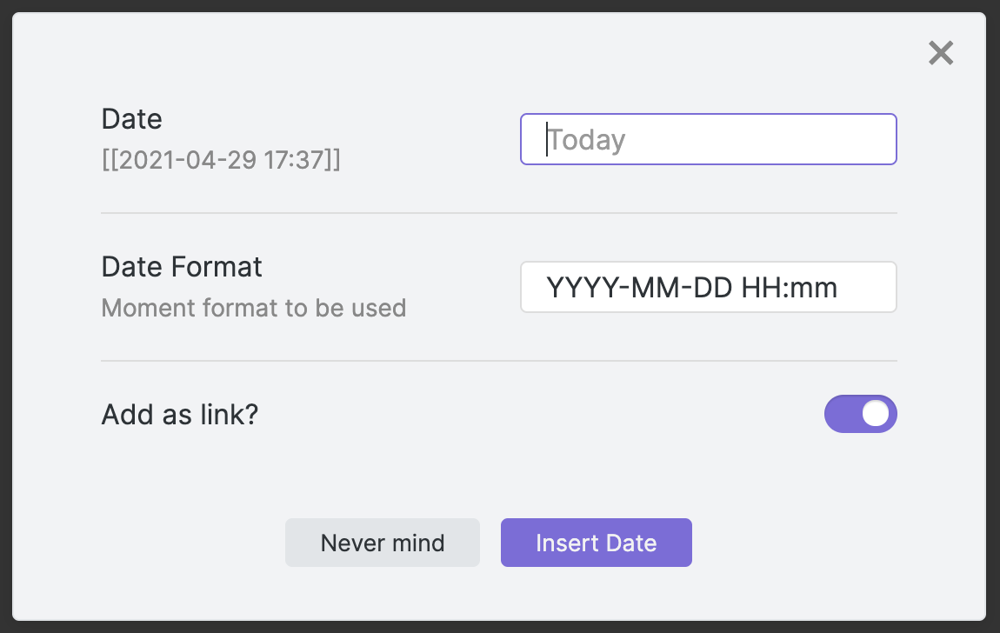

# Natural Language Dates in Obsidian

Insert timestamps and cross-link your daily notes with the flexibility of natural language. NLDates provides a suite of tools that makes working with dates and times within Obsidian frictionless.

## Features

- [Date Autosuggest](#date-autosuggest)
- [Custom `nldates` Obsidian URI](#nldates-uri-action)
- [Date Picker](#natural-language-dates-date-picker)

If a date is not recognized, the link won't be created.

## Date Autosuggest


Expand dates using natural language inline within the editor view.

Typing `@today` <kbd>Enter</kbd> will automatically be expanded to the current date. Press <kbd>Shift</kbd> at the same time to keep the input text as an alias (e.g. `@today` → `[[202112-27|today]]`).

### Configuration

| Setting         | Description                                             | Default |
| --------------- | ------------------------------------------------------- | ------- |
| Enable/Disable  | A global toggle to enable or disable the autosuggest    | Enabled |
| Trigger phrase  | Character(s) required to open the autosuggest           | `@`     |
| Insert as link? | Dates will be inserted as wikilinks (i.e. `[[<date>]]`) | Yes     |

## `nldates` URI Action

It's now possible to use the [Obsidian URI](https://publish.obsidian.md/help/Advanced+topics/Using+obsidian+URI) to open daily notes using natural language by using the nldates action `obsidian://nldates?day=<date here>`. Don't forget to [encode space characters](https://publish.obsidian.md/help/Advanced+topics/Using+obsidian+URI#Encoding) appropriately.

| `obsidian://nldates` Parameter | Description                             |
| ------------------------------ | --------------------------------------- |
| `day`                          | natural language date string            |
| `newPane`                      | open note in new pane, default is `yes` |

### Commands and Hotkeys

`nldates` adds a few commands to work with dates in natural language. You can add custom hotkeys for them by going to `Settings > Hotkeys` and filtering by `Natural Language Dates` (Note that hotkeys are unset by default starting on **v0.4.1**).

#### Natural Language Dates: Date Picker




Opens the date picker menu

#### Other Commands

| Setting                                     | Description                                                                                                                                                                                                                                                                                                                                                                       | Default                       |
| ------------------------------------------- | --------------------------------------------------------------------------------------------------------------------------------------------------------------------------------------------------------------------------------------------------------------------------------------------------------------------------------------------------------------------------------- | ----------------------------- |
| Insert current date                         | Inserts the current date, using the format specified in the settings menu                                                                                                                                                                                                                                                                                                         | `YYYY-MM-DD`                  |
| Insert current time                         | Inserts the current time, using the format specified in the settings menu                                                                                                                                                                                                                                                                                                         | `HH:mm`                       |
| Insert current date and time                | Inserts the current date, using the format specified in the settings menu                                                                                                                                                                                                                                                                                                         | `YYYY-MM-DD HH:mm`            |
| Parse natural language date                 | Parses the selected text as a natural language date. Replaces selected text with an obsidian link to the parsed date in the format specified in the settings menu. <br /><br />For single-word dates (e.g. today, tomorrow, friday, etc.), it's possible to use the command without selecting the word first. It's also possible to use dates like Nov9, 25Dec to use this trick. | `[[YYYY-MM-DD]]`              |
| Parse natural language time                 | Parses the selected text as a natural language time. Replaces selected text with the parsed time stamp in the format specified in the settings menu. You can try with any of the standard times, i.e. now, in 15min, in 1h, 5min ago, etc.                                                                                                                                        | `HH:mm`                       |
| Parse natural language date (as link)       | Parses the selected text as a natural language date. Replaces selected text with a standard markdown link to the parsed date in the format specified in the settings menu                                                                                                                                                                                                         | `[selected text](YYYY-MM-DD)` |
| Parse natural language date (as plain text) | Parses the selected text as a natural language date. Replaces selected text with a plain text parsed date in the format specified in the settings menu                                                                                                                                                                                                                            | `YYYY-MM-DD`                  |

**Note:** You can of course add hotkeys to each of these commands.

## Usage

### Examples

The parser supports most date/time formats, including:

- Today, Tomorrow, Yesterday, Last Friday, etc
- 17 August 2013 - 19 August 2013
- This Friday from 13:00 - 16.00
- 5 days ago
- 2 weeks from now
- Sat Aug 17 2013 18:40:39 GMT+0900 (JST)
- 2014-11-30T08:15:30-05:30

### Demo


> **Note**:
> The parser will replace all the selected text, meaning that in a sentence you should only select the dates to be parsed and not the full sentence.  
> In the example sentence `Do this thing by tomorrow`, only the word `tomorrow` should be selected. Alternatively, keep in mind that you can place your cursor **on** or **next to** the word tomorrow, and it will be replaced:


## How to install

In Obsidian go to `Settings > Third-party plugins > Community Plugins > Browse` and search for `Natural Language Dates`.

### Manual installation

Unzip the [latest release](https://github.com/argenos/nldates-obsidian/releases/latest) into your `<vault>/.obsidian/plugins/` folder.

## About

Powered by the [chrono](https://github.com/wanasit/chrono) library and some custom parsing.

### Custom Parsing

The only behaviours I changed were the following:

| Write          | Date                  |
| -------------- | --------------------- |
| next week      | next Monday           |
| next [month]   | 1st of next month     |
| mid [month]    | 15th of the month     |
| end of [month] | last day of the month |

## For Developers

NLDates provides an interface for you to parse natural language dates in your plugin. The `parsedDate()` function is available on the NaturalLanguageDates plugin instance. It has the following signature:

```ts
interface NLDResult {
  formattedString: string;
  date: Date;
  moment: Moment;
}

function parseDate(date: string): NLDResult;
```

- The `formattedString` will return the date formatted according to the settings of `nldates` and without the square brackets.
- The `date` object is what is returned by the `parseDate` method of the custom parser (using the [chrono](https://github.com/wanasit/chrono) package).
- The `moment` object is created with the `date` object.

### Example Usage

```ts
const nldatesPlugin = obsidianApp.plugins.getPlugin("nldates-obsidian");
const parsedResult = nldatesPlugin.parseDate("next year");
console.log(parsedResult.moment.format("YYYY")); // This should return 2021
```

### Typical String Formats and Tokens

| Input       | Example          | Description |
| ----------- | ---------------- | ----------- |
| `YYYY`      | `2014`           | 4 or 2 digit year. Note: Only 4 digit can be parsed on `strict` mode |
| `YY`        | `14`             | 2 digit year |
| `Y`         | `-25`            | Year with any number of digits and sign |
| `Q`         | `1..4`           | Quarter of year. Sets month to first month in quarter. |
| `M MM`      | `1..12`          | Month number |
| `MMM MMMM`  | `Jan..December`  | Month name in locale set by `moment.locale()` |
| `D DD`      | `1..31`          | Day of month |
| `Do`        | `1st..31st`      | Day of month with ordinal |
| `DDD DDDD`  | `1..365`         | Day of year |
| `X`         | `1410715640.579` | Unix timestamp |
| `x`         | `1410715640579`  | Unix ms timestamp |
| `gggg`      | `2014`           | Locale 4 digit week year |
| `gg`        | `14`             | Locale 2 digit week year |
| `w ww`      | `1..53`          | Locale week of year |
| `e`         | `0..6`           | Locale day of week |
| `ddd dddd`  | `Mon...Sunday`   | Day name in locale set by `moment.locale()` |
| `GGGG`      | `2014`           | ISO 4 digit week year |
| `GG`        | `14`             | ISO 2 digit week year |
| `W WW`      | `1..53`          | ISO week of year |
| `E`         | `1..7`           | ISO day of week |

For further information, see: [moment.js docs](https://momentjs.com/docs/#/parsing/string-format/).

### Manipulating the `moment` instance

If you need, you can further [manipulate](https://momentjs.com/docs/#/manipulating/) or [format](https://momentjs.com/docs/#/displaying/) the moment object, for example:

```typescript
const nldatesPlugin = obsidianApp.plugins.getPlugin("nldates-obsidian");
const nextYear = nldatesPlugin.parseDate("next year");

console.log(nextYear.moment.format("YYYY")); // This should return 2021
console.log(nextYear.moment.fromNow()); // "In two months"

const thisEvening = nldatesPlugin.parseDate("today at 21:00");
console.log(thisEvening.moment.add(1, "hour")); // This would change the Moment to 22:00
```

Note that if you manipulate the `parsedResult.moment`, the `date` and `formattedString` won't be updated. If you don't want to alter the `parsedResult.moment`, you should clone it. Read more about that on [the moment.js docs site](https://momentjs.com/docs/#/parsing/date/).


## Development Setup

```sh
git clone https://github.com/argenos/nldates-obsidian
cd nldates-obsidian
yarn install

yarn build
mkdir -p /path/to/vault/.obsidian/plugins/nldates-obsidian
cp -t /path/to/vault/.obsidian/plugins/nldates-obsidian/ main.ts manifest.json
```

And open your vault
